# **Constat Amiable Numérique**

## Description
Le projet **Constat Amiable Numérique** est une solution permettant de numériser le constat amiable d'accident automobile. Il comprend une application mobile destinée aux conducteurs, une API backend pour la gestion des données et une interface web d'administration.

## Modules du projet
  - **constat_mobile**: Application Flutter (bilingue) destinée aux conducteurs, les permet de remplir un constat (informations de l'accident, informations des véhicules, circonstances, croquis, signatures) et de générer un PDF officiel.

  - **backend_constat**: API REST Node.js/ Express/ MongoDB, permettant la gestion des données et le stockage des PDF générés.

  - **admin_constat**: Interface web React permettant aux administrateurs de consulter, filtrer et gérer les constats enregistrés.

## Sommaire
  - [Architecture du projet](#1-architecture-du-projet)
  - [Technologies utilisées](#2-technologies-utilisées)
  - [Guide d'installation](#3-guide-dinstallation)
   - [Configuration du backend](#a-configuration-du-backend)
   - [Configuration de l'application mobile](#b-configuration-de-lapplication-mobile)
   - [Configuration de l'interface admin](#c-configuration-de-linterface-admin)
  - [Historique des commits](#4-historique-des-commits)
### 1. Architecture du projet:
```text
    Constat
      |_ admin_constat
      |_ backend_constat
      |_ constat_mobile
      |_ README.md
```
### 2. Technologies utilisées:
- Flutter
- React + Vite
- Node.js
- Express
- MongoDB

### 3. Guide d'installation:
#### _a. Configuration du backend_
```bash
 #Se placer dans le dossier backend_constat:
 cd backend_constat

 #Installer les dépendances: 
 npm install

 #Lancer le serveur: 
 npm start
```
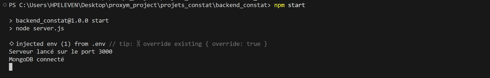
#### _b. Configuration de l'application mobile_
```bash
 #Se placer dans le dossier constat_mobile: 
 cd constat_mobile

 #Installer les dépendances Flutter: 
 flutter pub get

 #Lancer l'apllication en mode développement: 
 flutter run

 #Générer un APK installable: 
 flutter build apk --release
```
<p align="center">
  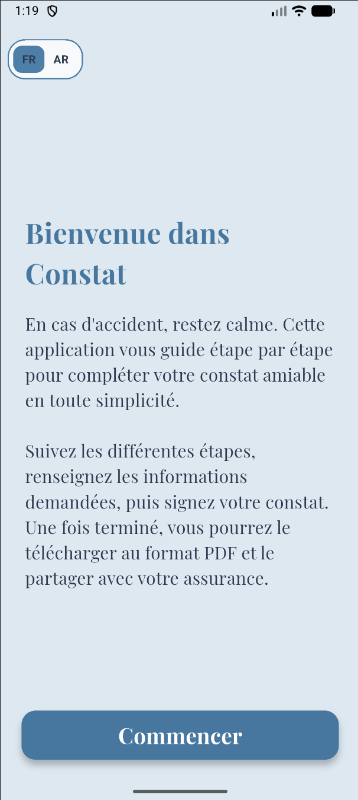
  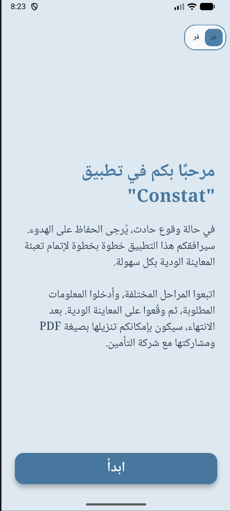
  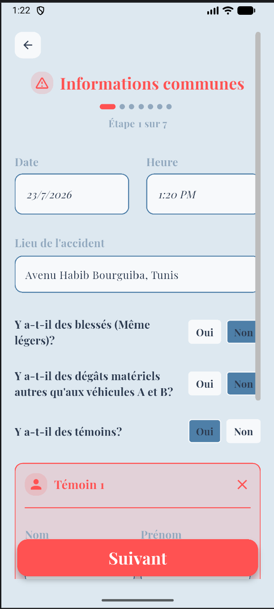
  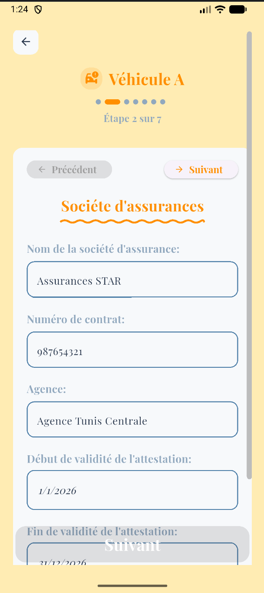
</p>
<p align="center">
  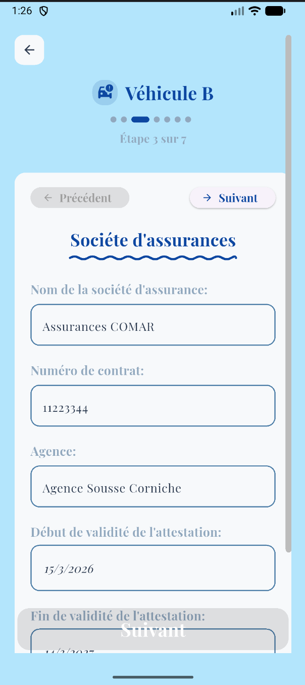
  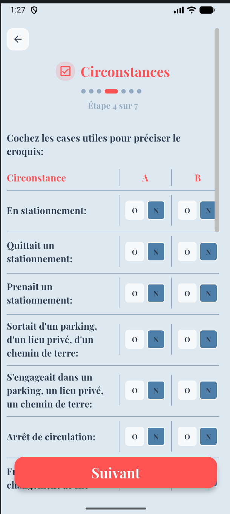
  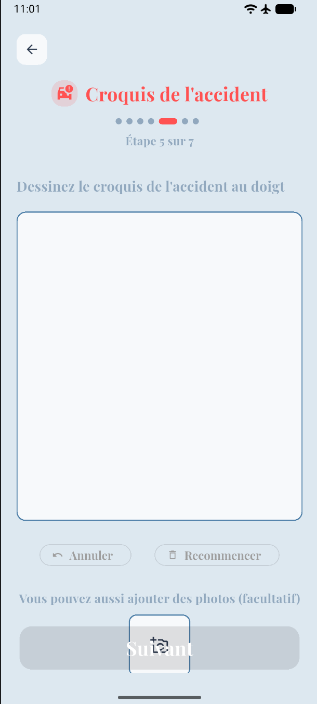
  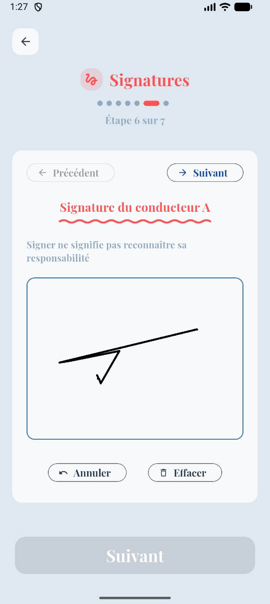
</p>
📄[Exemple de PDF généré en FR](captures/constatFR.pdf)
📄[Exemple de PDF généré en AR](captures/constatAR.pdf)

#### _c. Configuration de l'interface admin_
```bash
 #Se placer dans le dossier admin_constat: 
 cd admin_constat

 #Installer les dépendances: 
 npm install

 #Lancer le serveur de développement: 
 npm run dev
```
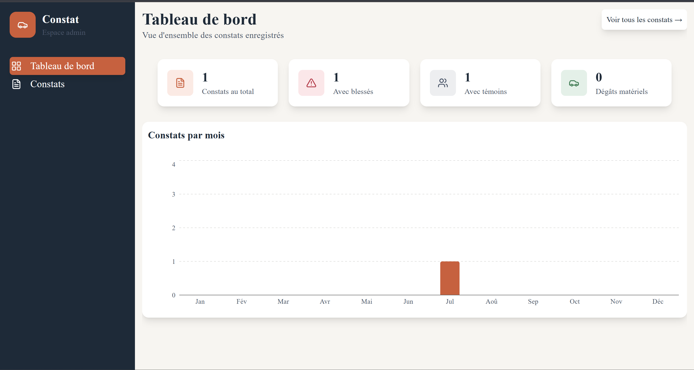
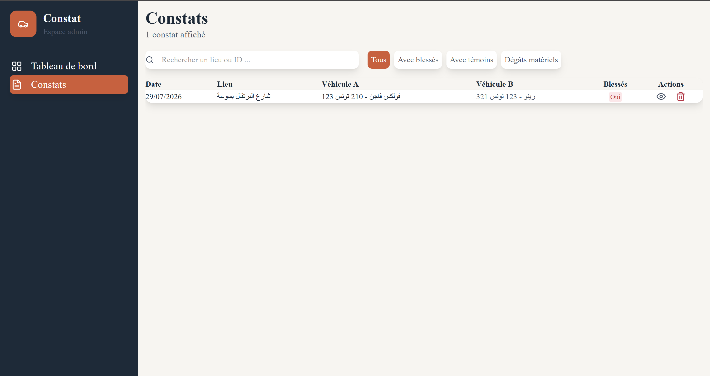
### 4. Historique des commits:
L'historique complet du développement (implémentation des fonctionnalités, corrections de bugs et évolutions de l'architecture) est disponible sur le dépôt GitLab du projet, via l'onglet **Repository > Commits**.